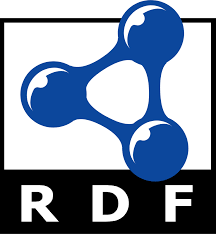
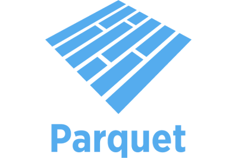

  
  &nbsp;&nbsp;&nbsp;
  
  &nbsp;&nbsp;&nbsp;
  

# RDFParquet

> A lightweight RDF engine that stores and manages triples using the Apache Parquet columnar format — developed as part of my Diploma Thesis at the University of Ioannina.

