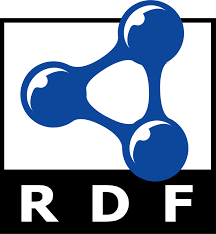
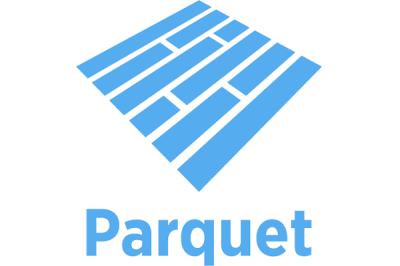

<p align="center">
  
  &nbsp;&nbsp;&nbsp;
  
  &nbsp;&nbsp;&nbsp;
  
</p>

# RDFParquet

[](../../actions)
[](../../releases)


> A lightweight RDF engine that stores and manages triples using the Apache Parquet columnar format, developed as part of my Diploma Thesis at the University of Ioannina.

## Quickstart

### Requirements
* **Java 17** or higher

### Installation
Download the latest release JARs from the [Release Page](https://github.com/AlexGeorgallis/RDFParquet/releases).

### 1. Load Data
Convert your RDF dataset (Supported formats: `.nt`, `.ttl`, `.rdf`) into the Parquet storage format. This creates a `./data` directory by default.

```bash
# Syntax
java -jar rdfparquet-loader.jar /path/to/your/dataset

# Example
java -jar rdfparquet-loader.jar /users/datasets/yago.ttl

```

### 2. Start the Server

```bash
# Syntax (Default port is 8080)
java -jar rdfparquet-server.jar [port]

# Example
java -jar rdfparquet-server.jar
```

### 3. Query
Open your browser and navigate to **http://localhost:8080** 

**macOS Users**: If you receive a warning about the file being damaged or from an unidentified developer, run the following command on the jars. 

`xattr -d com.apple.quarantine rdfparquet-*.jar`

---

# Architecture

## The Storage Pipeline


1. **Parsing**: Input data is parsed using Apache Jena.
2. **Dictionary Encoding**: URIs and Literals are mapped to Integer IDs.
3. **Permutation Generation**: The system generates 6 Parquet files, representing every possible sort order of Subject (S), Predicate (P), Object (O):

`SPO`, `SOP`, `PSO`, `POS`, `OSP`, `OPS`.

4. **Parquet Storage**: Data is written using `Snappy` compression for the 6 Permutation files and `ZSTD` for the dictionary file.

## The Query Pipeline


- **Parsing**: The engine accepts SPARQL queries.
- **Planning**: The optimizer analyzes the Triple Patterns (TP) and selects the most efficient Parquet file to scan.
  - Example: A query filtering by `?s ?p <Object>` will utilize the `OPS` or `OSP` files to locate the object immediately.
- **Execution**: The engine performs dictionary lookups on the fly and utilizes **Sort-Merge Joins**.

---

## Performance & Benchmarks 

The performance of RDFParquet was evaluated against **BlazeGraph** and **Apache Jena Fuseki** using the **YAGO (tiny)** and **BSBM** (Berlin SPARQL Benchmark) datasets. 

### 1. Storage Footprint
RDFParquet demonstrates a massive reduction in storage requirements due to Parquet's columnar compression and dictionary encoding. 

| Dataset | System | Storage Size | Reduction |
| :--- | :--- | :--- | :--- |
| **YAGO** | **RDFParquet** | **309.9 MB** | **~95%** |
| | Fuseki | 3.38 GB | |
| | BlazeGraph | 7.02 GB | |
| **BSBM** | **RDFParquet** | **628 MB** | **~85%** |
| | BlazeGraph | 3.61 GB | |
| | Fuseki | 4.26 GB | |

---

### 2. YAGO Benchmark Results

#### Query Patterns

* **Q1 (Type filter):** `?person rdf:type schema:Person`
* **Q2 (Star Join):** `?instance rdf:type ?type; schema:mainEntityOfPage ?page; schema:image ?image`
* **Q3 (Path Join):** `?taxon schema:parentTaxon ?parent . ?parent schema:parentTaxon ?grandparent ...` (4-hop traversal)
* **Q4 (Multi-Attribute):** `?instance schema:geo ?geo; schema:image ?image`

#### Execution Time (Seconds)
RDFParquet significantly outperforms competitors in cold-cache scenarios and complex joins (Q2, Q4). 

| Query | Cache Type | RDFParquet | BlazeGraph | Fuseki |
| :--- | :--- | :--- | :--- | :--- |
| **Q1** | **Cold** | 0.547s | **0.351s** | 1.850s |
| | Hot | 0.040s | **0.036s** | 0.093s |
| **Q2** | **Cold** | **2.358s** | 6.392s | 35.824s |
| | Hot | **0.864s** | 3.568s | 29.500s |
| **Q3** | **Cold** | **0.652s** | 0.662s | 0.868s |
| | Hot | 0.083s | **0.071s** | 0.165s |
| **Q4** | **Cold** | **0.852s** | 2.038s | 5.933s |
| | Hot | **0.081s** | 0.338s | 0.884s |

---

### 3. BSBM Benchmark Results

#### Query Patterns
* **Q1 (Metadata):** `?entity rdfs:label ?label; rdf:type ?type`
* **Q2 (Person Data):** `?person foaf:name ?name; rdf:type foaf:Person; bsbm:country ?country`
* **Q3 (Price Scan):** `?offer bsbm:price ?price`
* **Q4 (Foreign Key):** `?review bsbm:reviewFor ?product`

#### Execution Time (Seconds)
RDFParquet maintains a consistent lead in both cold and hot cache states for the BSBM dataset.

| Query | Cache Type | RDFParquet | BlazeGraph | Fuseki |
| :--- | :--- | :--- | :--- | :--- |
| **Q1** | **Cold** | **1.494s** | 2.250s | 7.757s |
| | Hot | **0.067s** | 0.202s | 2.533s |
| **Q2** | **Cold** | **1.107s** | 1.155s | 6.101s |
| | Hot | **0.073s** | 0.238s | 0.642s |
| **Q3** | **Cold** | **1.649s** | 7.154s | 52.342s |
| | Hot | **0.597s** | 5.715s | 33.152s |
| **Q4** | **Cold** | **0.917s** | 2.628s | 34.245s |
| | Hot | **0.315s** | 2.107s | 12.884s |
